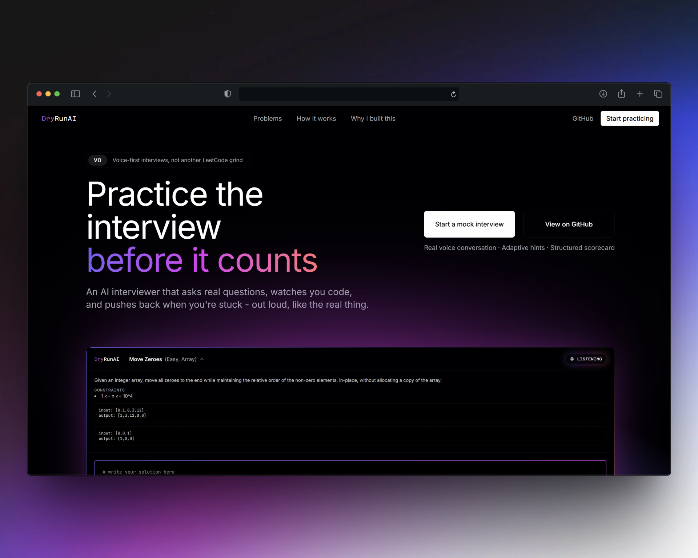

<div align="center">
<br />

# DryRunAI

### Practice the interview before it counts.

An AI interviewer that asks real questions, watches you code, and pushes back when you're stuck - out loud, like the real thing.

<p>
  
  
  
  
  
  
  
</p>

</div>

<br />

<div align="center">



</div>

<br />

## Why

Most practice tools grade a final answer. Real interviews don't work like that - you think out
loud, get follow-ups, and have to handle a nudge without losing the thread. DryRunAI is built to
rehearse that specific skill: **the conversation, not just the code.**
<br />

## Features

- **Real voice conversation** - powered by [Pipecat](https://github.com/pipecat-ai/pipecat),
  [Deepgram Flux](https://developers.deepgram.com/docs/flux) (streaming speech-to-text with
  built-in end-of-turn detection) and [Deepgram Aura-2](https://developers.deepgram.com/docs/aura-2)
  text-to-speech, with [Silero VAD](https://github.com/snakers4/silero-vad) for natural barge-in -
  interrupt the interviewer mid-sentence like you would a real person.
- **Clarifying questions first** - nothing gets coded until the constraints are nailed
  down. It won't hand you the edge cases; you have to ask.
- **Sees your code as you write it** - periodic snapshots of your editor, not a live
  keystroke feed, close enough to follow your actual approach.
- **Adaptive hints** - the smallest hint that unblocks you when you're stuck, never the
  full solution.
- **Two interviewer personas** - Neutral & realistic, or Strict & high-bar.
- **A real scorecard at the end** - correctness, complexity, problem-solving approach,
  and communication, persisted alongside the full transcript for later review.
- **50-problem bank** spanning Arrays/Strings and Linked Lists across Easy/Medium/Hard,
  each with a harder escalation problem in the same topic if you solve the first one well.

<br />

## Tech stack

<table>
<tr><td><b>Frontend</b></td><td>Next.js (App Router), TypeScript, Tailwind CSS</td></tr>
<tr><td><b>Backend</b></td><td>Python, FastAPI</td></tr>
<tr><td><b>Voice orchestration</b></td><td>Pipecat</td></tr>
<tr><td><b>Speech-to-text</b></td><td>Deepgram Flux</td></tr>
<tr><td><b>Text-to-speech</b></td><td>Deepgram Aura-2</td></tr>
<tr><td><b>Turn-taking / barge-in</b></td><td>Silero VAD</td></tr>
<tr><td><b>LLM</b></td><td>Groq (Llama 3.3 70B) - live conversation + scorecard</td></tr>
</table>

Runs entirely locally - no hosting, no database, no auth in the current version. Session
transcripts, code snapshots, and scorecards are written to local JSON files.

<br />

## Getting started

**Prerequisites:**

- [Node.js](https://nodejs.org) 20+ - check with `node --version`
- [Python](https://python.org) 3.11+ - check with `python --version`
- A [Deepgram](https://console.deepgram.com) API key 
- A [Groq](https://console.groq.com) API key

<details open>
<summary><b>1. Clone the repo</b></summary>

<br />

```bash
git clone https://github.com/yuvraj-kumar-dev/DryRunAI.git
cd DryRunAI
```

</details>

<details open>
<summary><b>2. Configure environment variables</b></summary>

<br />

There's a single `.env` at the repo root, shared by both frontend and backend.

```bash
cp .env.example .env
```

Open `.env` and fill in:

```bash
DEEPGRAM_API_KEY=your_deepgram_key_here
GROQ_API_KEY=your_groq_key_here
GROQ_MODEL=llama-3.3-70b-versatile   # default, change if you want a different Groq model
BACKEND_PORT=8000
NEXT_PUBLIC_BACKEND_URL=http://localhost:8000
```

</details>

<details open>
<summary><b>3. Start the backend</b></summary>

<br />

In one terminal, from the repo root:

```bash
cd backend
python -m venv .venv
```

Activate the virtual environment:

```bash
.venv\Scripts\activate       # Windows (cmd/PowerShell)
source .venv/bin/activate    # macOS/Linux
```

Install dependencies and start the server:

```bash
pip install -r requirements.txt
uvicorn app.main:app --reload --port 8000
```

Verify it's up - in a second terminal:

```bash
curl http://localhost:8000/health
```

You should get back `{"status":"ok"}`. If `GROQ_API_KEY`/`DEEPGRAM_API_KEY` are missing, check
`GET /config/status` for which ones the server actually loaded from `.env`.

</details>

<details open>
<summary><b>4. Start the frontend</b></summary>

<br />

In a new terminal (leave the backend running), from the repo root:

```bash
cd frontend
npm install
npm run dev
```

</details>

<details open>
<summary><b>5. Start a session</b></summary>

<br />

Open [http://localhost:3000](http://localhost:3000) in your browser. Click **Start practicing**,
pick a category/difficulty/interviewer style, and grant microphone access when prompted -
DryRunAI needs it for the live voice conversation. The interviewer greets you first; wait for it
to finish before responding, or just interrupt it like a real conversation.

<br />

## Project structure

```
frontend/          Next.js app (marketing homepage, session picker, interview screen)
backend/
  app/
    main.py        FastAPI routes (session creation, code snapshots, /ws/voice)
    voice.py       Pipecat voice pipeline + interviewer tools
    interview.py    Persona prompts + scorecard generation
    problems.py     Problem bank loader/selection
    data/           The 50-problem bank
sessions/           Persisted session transcripts (local only, gitignored)
```
